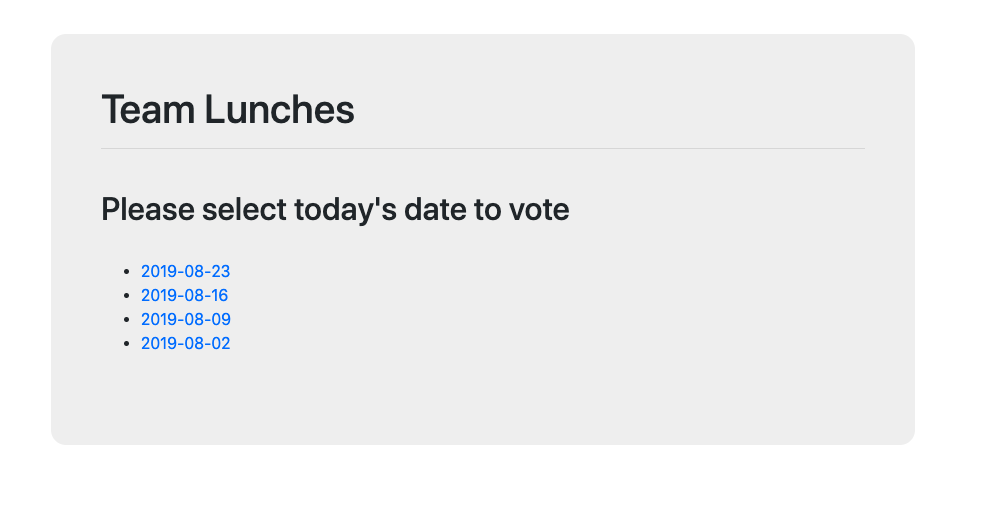
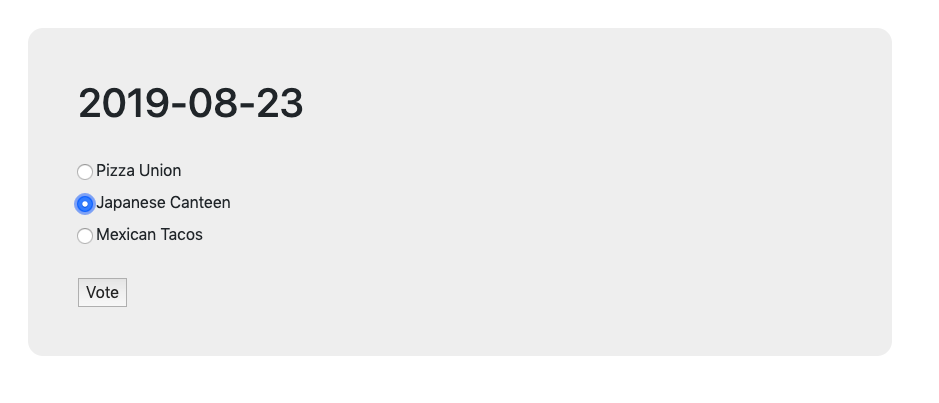
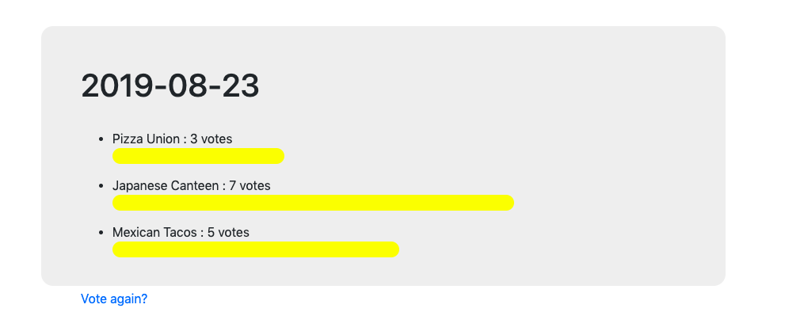

# Team lunches poll app

This was my first attempt at learning Django and making a full stack app, it took one day and I followed this tutorial: https://docs.djangoproject.com/en/2.2/intro/

## Technologies

- HTML
- CSS & Bootstrap
- Python
- Django
- mySQL Lite

## Set Up

Once you clone or download the repo, use these commands in the terminal: 

```
$ python manage.py runserver 
```

Navigate to http://localhost:8000/polls/ and you should see the homepage. 

## Models 

The app has two models, questions and choices: 

```
class Question(models.Model):
    question_text = models.CharField(max_length=200)
    pub_date = models.DateTimeField('date published')

    def __str__(self):
        return self.question_text

    def was_published_recently(self):
        now = timezone.now()
        return now - datetime.timedelta(days=1) <= self.pub_date <= now

class Choice(models.Model):
    question = models.ForeignKey(Question, on_delete=models.CASCADE)
    choice_text = models.CharField(max_length=200)
    votes = models.IntegerField(default=0)

    def __str__(self):
        return self.choice_text
``` 

### INDEX TEMPLATE (view: IndexView(generic.ListView))

In this template the user can pick which date to vote in.




### DETAIL TEMPLATE (view: DetailView(generic.DetailView))

In this template the user gets to submit their vote. 



### RESULTS TEMPLATE (view: ResultsView(generic.DetailView))

In this template, the user can see what other users voted for and which restaurant was the favourite. They can also go back and vote again. 



## Future Improvements

This was a fun way to get started in Django, in the future I'm hoping to add a user feature so that the users have to login in order to use and then it will be possible to see/display who voted for which option. 


